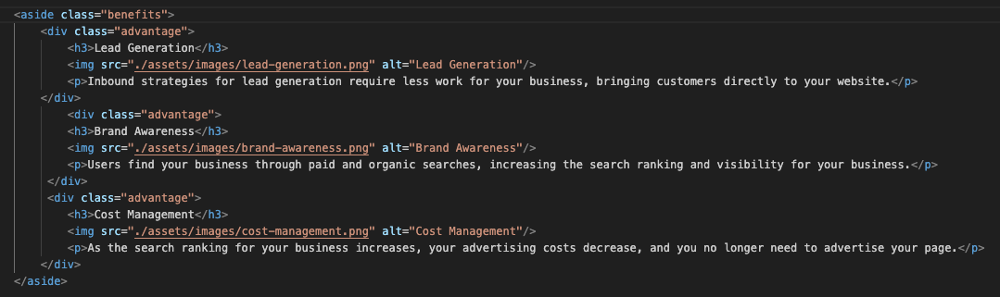

# Horiseon Refactor Challenge

## Description 

This project is the first challenge of many in the 2023 edX Front-End Development Bootcamp.
It is a refactor project, where the main goal is rework the source code (HTML/CSS) in a one page website of a fictional Marketing Agency called Horiseon.

**A snippet from the challenge description:**
"Web accessibility is an increasingly important consideration for businesses. It ensures that people with disabilities can access a website using assistive technologies such as video captions, screen readers, and braille keyboards. Making a website accessible is also good for business for many reasons, one of them being that accessible sites are better positioned in search engines like Google. It also helps companies avoid litigation that can occur when people with disabilities cannot access their website.
Even though accessibility is a broad topic that can include complex requirements, your tech lead has given you a small list of specific criteria to satisfy the project. These criteria are documented below in the Acceptance Criteria. 
To impress clients, you should always go the extra mile and improve the codebase for long-term sustainability. For example, make sure that all links are functioning correctly. Also, rework the CSS to make it more efficient by consolidating CSS selectors and properties, organizing them to follow the semantic structure of the HTML elements, and including comments before each element or section of the page.

An **important** rule was to follow when working with someone else's code is the **Scout Rule**, which recommends that you always leave the code a little cleaner than when you found it".

---

## Installation

The work environment has been Visual Studio Code for this project, with the help of Firefox Developer Edition's built-in faetures for examining the live page.

## Original state and findings

**HTML**

The original source code was very loosely written, such as the webpage had no proper title, meta tags had been missing,
and the sections in different elements of the page has been stated as 'div's. Here is below some examples:

 

The head is missing a proper website title, meta tag such as title, keywords, description, canonical and so on.

Navigation 

The main content seem overcomplicated, and has a lot of white space.

Right section suffers from the same issue as the main

**CSS**

These elements has the same values, therefore unnecesary to duplicate

The right section seems to have the same issue

## Solved Issues

**HTML**

 

The head section had been updated with title and neccesary meta tags for both accessibility and seo purposes.

 

Navigation

 

Main content section rework, elements now fall under the same class and attributes had been changed for accessiability.

 

The same with 'aside' section

 

Morevover, 
For a more professional look, 'Made with love' part had been erased from footer.

**CSS**

Header and navigation prooperly named.

As elements had been polished and became part of the same classes, a more streamlined css file was the result.

The "logo" had a part which emphasizes the main mission of the company. There is no control in the original css file.
It is worth to emphasize it, as it helps with UX.

**Site shot**

## License

The project served under the MIT License.
The MIT License is a permissive free software license originating at the Massachusetts Institute of Technology (MIT) in the late 1980s. As a permissive license, it puts only very limited restriction on reuse and has, therefore, high license compatibility.

---

## Badges

Built with:

## Features

The actual version (1.0) released as an MVP product, which hence covers challenges requirements, the code will go through extensive rework from time to time, to add out-of-scope features, such as responsivity.

---
(c) 2023 oIdiOn. All rights thrown out of the window.